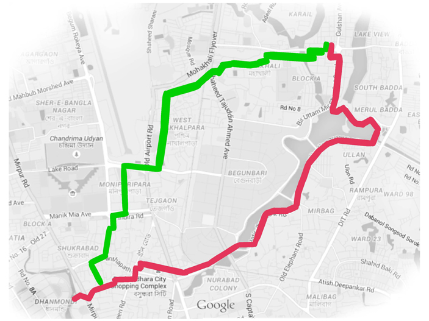
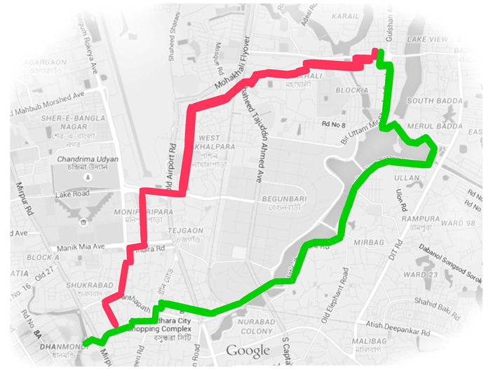
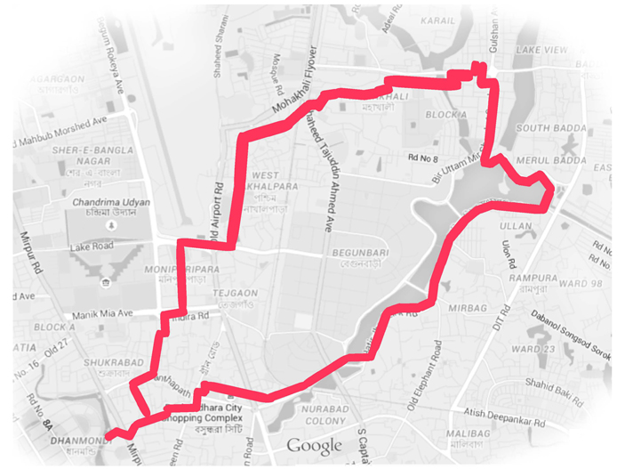
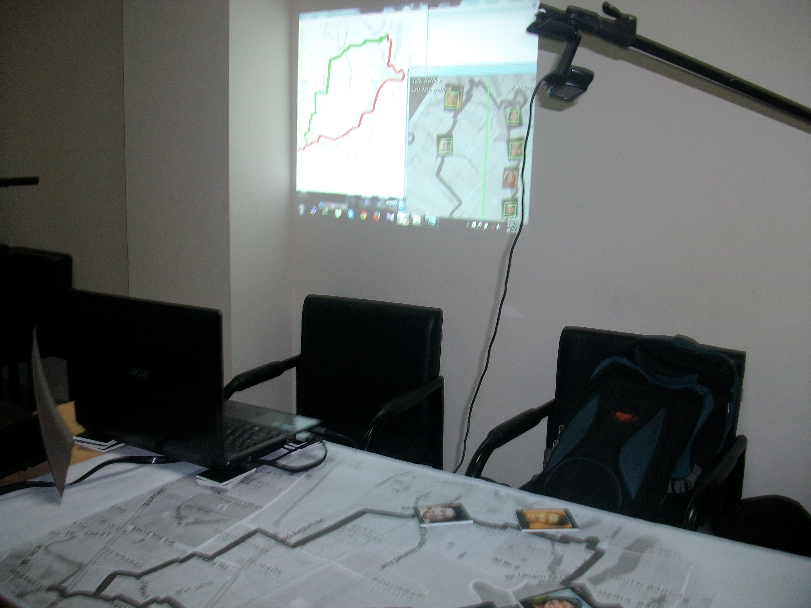
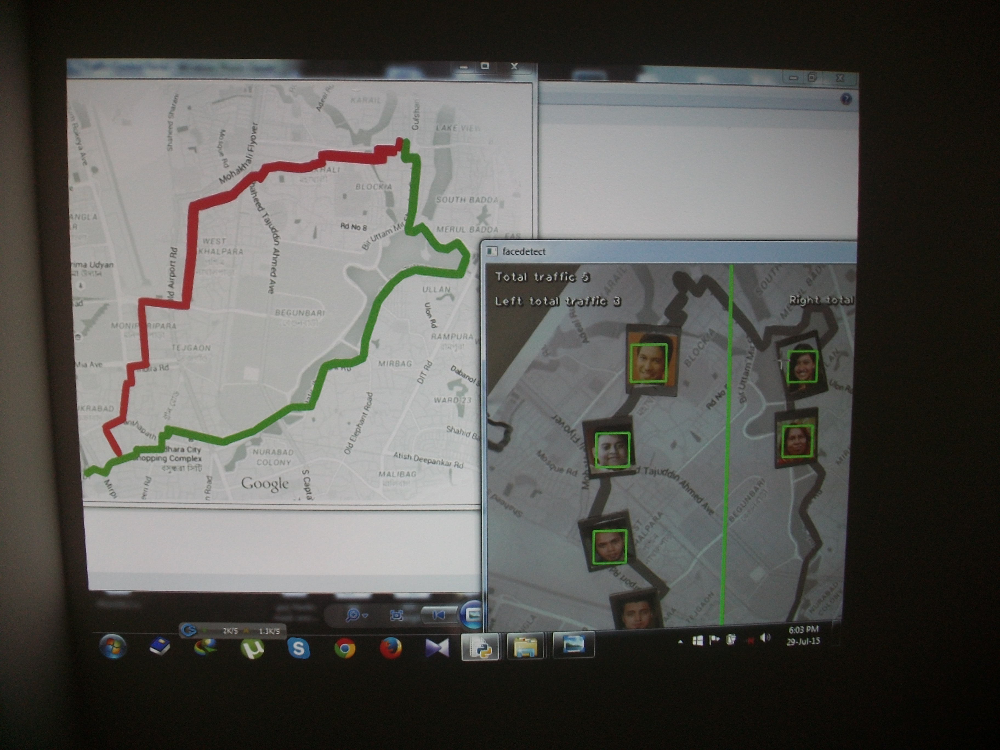

# VIRTRACC: Augmented Reality Traffic & Crowd Flow Control System


**VIRTRACC** is a computer vision and augmented reality prototype developed to assist city planners in monitoring simulated traffic and controlling crowd flow.

The project was developed as the final project of the **KolpoKoushol 2015 Engineering Workshop**, an intensive program led and mentored by students and alumni of the **MIT Media Lab**.

The system uses an overhead camera to detect and count objects placed on different regions of a physical map. Based on the number of detected objects in each region, the system identifies congestion conditions and displays a predefined alternative route or congestion warning.


---

## Project Background

VIRTRACC was developed as a team project during the 2015 KolpoKoushol engineering workshop.

The workshop challenged participants to develop a technical product concept combining computer science, engineering, product design, and problem solving.

For VIRTRACC, the team created an augmented-reality-style traffic simulation in which an overhead camera observes physical blocks placed on a paper map. The detected objects represent traffic/crowd elements, allowing the system to simulate congestion and suggest alternative routes.

I wrote most of the software implementation and learned OpenCV with Python during the development of the project.


---

## Key Features

### 1. Zone-Based Object Detection

The camera frame is divided into two spatial regions:
- **Left zone**
- **Right zone**

Detected objects are classified according to their horizontal position relative to the center of the camera frame.

```text
                 Camera Frame
        +---------------------------+
        |             |             |
        |  LEFT ZONE  | RIGHT ZONE  |
        |             |             |
        |      ● ●    |      ●      |
        |       ●     |    ● ● ●    |
        |             |             |
        +---------------------------+
                    ^
               Center Line
```

The implementation counts detected objects independently in each region.

---

### 2. Haar Cascade Detection

The prototype uses OpenCV Haar Cascade classifiers for object detection.

The original implementation performs:
1. Grayscale conversion
2. Histogram equalization
3. Multi-scale Haar Cascade detection
4. Bounding-box generation
5. Region-based counting

```python
gray = cv2.cvtColor(img, cv2.COLOR_BGR2GRAY)
gray = cv2.equalizeHist(gray)

rects = detect(gray, cascade)
```

---

### 3. Congestion Decision Engine

The system compares the number of detected objects in each zone against configurable thresholds.

```text
              Detected Objects
                     |
          +----------+----------+
          |                     |
      Left Count             Right Count
          |                     |
          +----------+----------+
                     |
              Threshold Check
                     |
        +------------+------------+
        |            |            |
        v            v            v
     Left busy    Right busy   Both busy
        |            |            |
        v            v            v
    Display       Display       Display
    map3.jpg      map2.jpg       red.jpg
```

The current prototype uses:
```python
left_threshold = 2
right_threshold = 2
```

---

## Route Decision Logic

| Condition | Interpretation | System Response |
|---|---|---|
| Left below threshold, Right above threshold | Right side congested | Display `map2.jpg` |
| Left above threshold, Right below threshold | Left side congested | Display `map3.jpg` |
| Left and Right above threshold | Both sides congested | Display `red.jpg` |
| Both below threshold | No congestion detected | No alternative map displayed |

The routing logic is implemented using simple threshold-based rules, making the prototype easy to modify for different environments or experimental settings.

### Routing Output Examples

Depending on the detected congestion thresholds, the system dynamically outputs one of the following route visualizations:

**1. Right Route Congested**
*(System Output: `map2.jpg`)*


**2. Left Route Congested**
*(System Output: `map3.jpg`)*


**3. Both Routes Congested**
*(System Output: `red.jpg`)*


---

## Real-Time Visualization

The system overlays information directly on the camera feed, including:
- Total detected objects
- Left-zone count
- Right-zone count
- Bounding boxes around detected objects
- Center dividing line

Example output:
```text
Total traffic 5
Left total traffic 2
Right total traffic 3
```

---

## System Architecture

```text
             +-----------------------+
             |   Overhead Camera     |
             +-----------+-----------+
                         |
                         v
             +-----------------------+
             | OpenCV Image Capture  |
             +-----------+-----------+
                         |
                         v
             +-----------------------+
             | Grayscale Conversion  |
             | Histogram Equalization|
             +-----------+-----------+
                         |
                         v
             +-----------------------+
             | Haar Cascade Detection|
             +-----------+-----------+
                         |
                         v
             +------------------------+
             | Spatial Classification |
             |    Left / Right Zone   |
             +-----------+------------+
                         |
                         v
             +-----------------------+
             | Object Count +        |
             | Threshold Evaluation  |
             +-----------+-----------+
                         |
              +----------+----------+
              |          |          |
              v          v          v
           map3.jpg    map2.jpg   red.jpg
```

---

## Hardware & Experimental Setup

To capture the physical map in real time, the system utilized a head-mounted camera positioned above the experimental setup. This allowed the OpenCV pipeline to continuously monitor the physical blocks placed on the map.




---

## Technical Stack

- **Python 2.7**
- **OpenCV**
- Haar Cascade Classifiers
- Real-time video processing
- Image processing
- Rule-based decision logic
- Augmented-reality-style physical map interaction

---

## Research / Engineering Concepts

VIRTRACC explores several concepts relevant to computer vision, spatial monitoring, and traffic-flow simulation:
- Real-time computer vision
- Object detection
- Spatial object tracking
- Image preprocessing
- Region-based counting
- Threshold-based decision systems
- Visual feedback
- Traffic-flow simulation
- Human-computer interaction
- Augmented reality concepts

---

## Limitations

This repository contains the **original 2015 prototype** rather than a production-ready traffic monitoring system.

Some limitations of the original implementation include:
- Haar Cascade detection is sensitive to the visual characteristics of the target objects.
- The camera view is divided into only two fixed spatial regions.
- Congestion thresholds are manually configured.
- The system uses simple rule-based routing rather than an optimization algorithm.
- The implementation depends on an older Python/OpenCV environment.

These constraints reflect the scope and goals of the original workshop prototype.

---

## Project Context

**KolpoKoushol Engineering Workshop — 2015**

The project was completed during an intensive six-day engineering workshop. The project was developed as the final project of the KolpoKoushol 2015 Engineering Workshop, an intensive engineering program organized and mentored by students and alumni associated with MIT Media Lab.

VIRTRACC was developed by a student team as the final project of the workshop. The project was completed in approximately two days, with most of the software implementation written by me.

---

## Author

**Shaswata Shaha**

Research interests:
- Efficient Deep Learning Architectures
- Real-Time Spatial Computing
- Edge AI

---

## Historical Note

This repository is preserved as a record of an early computer vision and augmented-reality engineering project.

The project demonstrates an early exploration of applying computer vision to real-world spatial decision-making and intelligent traffic management.

This early project represents an initial exploration of computer vision and spatial decision-making, preceding my later work in deep learning and Convolutional Neural Network optimization.

---

## Project Recognition

My participation in the KolpoKoushol 2015 Engineering Workshop was part of a national selection process in which 60 participants were selected from approximately 400 applicants. VIRTRACC was developed as my team's final project during the workshop.

The project's mentor, Nazmus Saquib, Founder and Director of KolpoKoushal and a graduate student at the MIT Media Lab at the time, provided a recommendation highlighting my contribution to the project.

The letter notes that:
- I was selected as one of **60 final participants from approximately 400 applicants** nationwide.
- VIRTRACC was developed as the team's final project during the workshop.
- I wrote **most of the software implementation** for the project.
- I taught myself **OpenCV with Python** during the development process.
- The project was completed by the team in approximately **two days**.
- The project demonstrated the application of computer vision to traffic monitoring and crowd-flow management.

### Recommendation Letter

The original recommendation letter is available in this repository:

**[View Recommendation Letter](./VIRTRACCShaswataShaha.pdf)**
